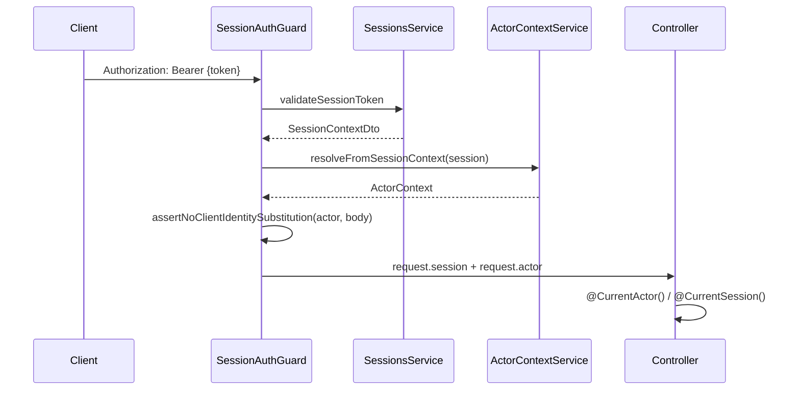

# Authenticated Actor Context — Trust Boundary

## Purpose

HeartStone protected government operations must never trust client-supplied identity or institutional identifiers. The **Authenticated Actor Context** (`ActorContext`) is the canonical, server-derived identity envelope attached to every session-authenticated request.

Actor context answers:

> **Who is the authenticated actor, and what institutional relationships currently exist?**

It does **not** answer:

> **May this actor perform this specific consequential government action?**

That second question remains exclusively with `AuthorityEvaluationService`.

## Separation of concerns

| Component | Responsibility |
|---|---|
| `SessionAuthGuard` | Validates bearer token; rejects revoked/expired sessions and inactive accounts |
| `ActorContextService` | Loads current institutional relationships for the session identity |
| `@CurrentActor()` | Exposes server-resolved `ActorContext` to controllers |
| `@CurrentSession()` | Exposes minimal session facts (legacy/compatible) |
| `AuthorityEvaluationService` | Evaluates whether an institutional actor may perform a function action |
| `InstitutionalActorResolver` | Resolves a specific institutional binding for authority evaluation input |

## Invariants

1. **User ≠ Identity ≠ Officeholder ≠ Appointment ≠ Role ≠ Permission ≠ Authority**
2. Authentication proves who the actor is; it never grants government authority.
3. `ActorContext` is built only from validated session state keyed by `session.identityId`.
4. Client payload fields (`identityId`, `userAccountId`, `personId`, `sessionId`) cannot override server-derived actor identity.
5. OIDC claims, MFA assurance levels, and organizational memberships are descriptive facts — not authority grants.
6. Service identities (`IdentityType.SERVICE`) never receive human officeholder institutional context.
7. Only **active/current** relationships are included:
   - active organization memberships
   - active representative authorities
   - active identity–officeholder links
   - current appointments
   - current delegations
8. Revoked, expired, or suspended records are excluded defensively at resolution time.

## Request flow



## What ActorContext exposes

- Core identity: `identityId`, `userAccountId`, `personId`, `identityType`
- Session metadata: `sessionId`, `assuranceLevel`, issued/expiry timestamps, IP/user-agent
- Organization memberships (active/current)
- Representative authorities (active/current)
- Linked officeholder records (active links only)
- Active appointments with institution/department/office context
- Active delegations
- Derived institution contexts (non-authoritative aggregation)

## What ActorContext explicitly excludes

- `hasGovernmentAuthority`
- granted action types
- authority evaluation outcomes
- permission or role conclusions inferred from OIDC claims

## Usage guidance for controllers

```typescript
@UseGuards(SessionAuthGuard)
export class ExampleController {
  handler(@CurrentActor() actor: ActorContext) {
    // Always use actor.identityId — never trust body.identityId
  }
}
```

When a route accepts institutional selectors (`officeholderId`, `appointmentId`, `delegationId`) for a specific action, validate those selectors against `actor` relationships using `ActorContextService.assertInstitutionalSelectorsBoundToActor()` (also enforced centrally by `ConsequentialActionService` before authority evaluation). Never treat client identity fields as authoritative.

`ActorContextService.buildResolutionAudit()` produces a server-verified snapshot (identity, person, officeholder link, appointment, delegation, institution, effective time) suitable for attaching to consequential action handling and future audit persistence.

## Related documentation

- `docs/architecture/phase-3-identity-access.md`
- `docs/architecture/phase-4-authority-policy-engine.md`
